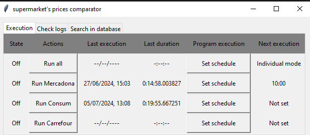
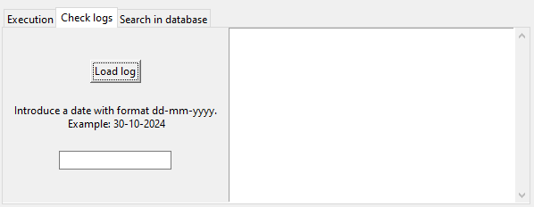
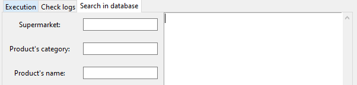

---INTRODUCTION---

This program allows to get the prices and other relevant information about products scrapping them from supermarket websites.

To try by your own you will need to add your on database introducing your own credentials and html direction in database.py class:
    credentials.Certificate = credentials.Certificate(os.getcwd()+"\\{json_credentials_file}")
    firebase_admin.initialize_app(self.cred, {"databaseURL": {database_http_direction}})

To modify or change products to be scrapped, check basket.py file.
New tab will be added to allow this functionality for a non skilled user on next versions.

---INTERFACE---

>Execution tab
This tab allows the user to start scrapping pressing Run or program the execution of a scrapping process.

>Log tab
This tab allows the user to see log files searching them by date.
Note: Window is resizable.

>Database tab
This tab allows the user to search scrapped products on the database.
More searching tools will be implemented on next's version
Note: Window is resizable.

